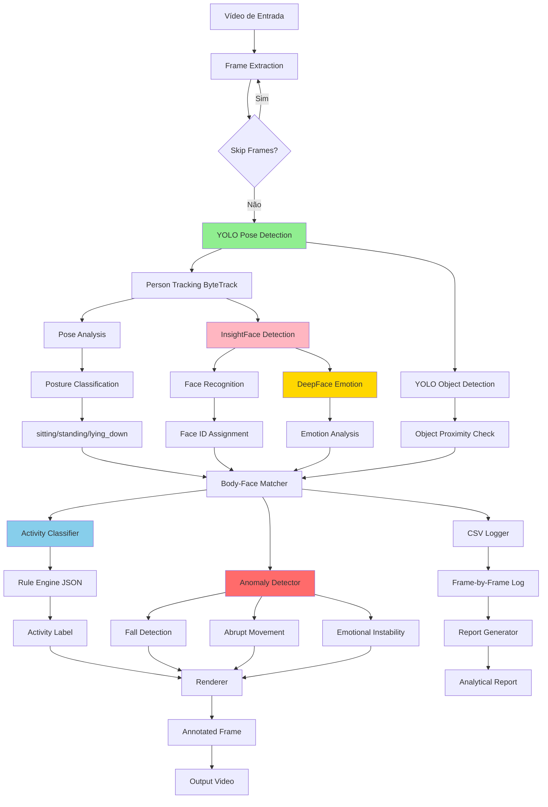
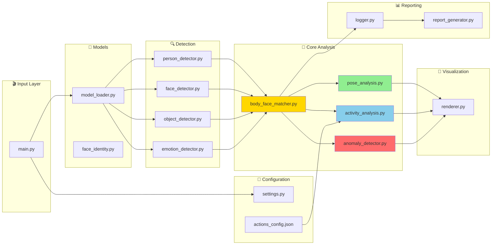
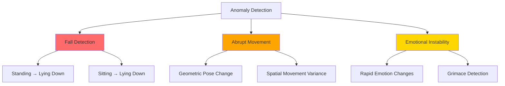
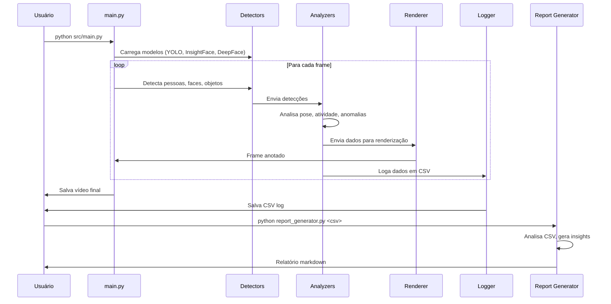

# 🎥 Sistema de Análise de Vídeo com IA

**Tech Challenge - Fase 4 | FIAP Pós-Graduação | Grupo 117**

Sistema avançado de análise de vídeo com detecção de pessoas, reconhecimento facial, análise de emoções, classificação de atividades e detecção de anomalias comportamentais usando modelos de IA de última geração.

[](https://www.python.org/downloads/)
[](https://github.com/ultralytics/ultralytics)
[](https://github.com/deepinsight/insightface)
[](https://github.com/serengil/deepface)

---

## 📋 Índice

- [Visão Geral](#-visão-geral)
- [Arquitetura](#-arquitetura)
- [Funcionalidades](#-funcionalidades)
- [Instalação](#-instalação)
- [Uso](#-uso)
- [Configuração](#-configuração)
- [Estrutura do Projeto](#-estrutura-do-projeto)
- [Saídas](#-saídas)
- [Performance](#-performance)
- [Desenvolvimento](#-desenvolvimento)

---

## 🎯 Visão Geral

Este sistema processa vídeos em tempo real para:

- 👤 **Detectar e rastrear pessoas** com tracking persistente
- 😊 **Reconhecer faces e analisar emoções** de cada indivíduo
- 🎯 **Classificar atividades** (lendo, trabalhando, acenando, etc.)
- ⚠️ **Detectar anomalias** (quedas, movimentos abruptos, instabilidade emocional)
- 📊 **Gerar relatórios analíticos** com insights automáticos

### Modelos de IA Utilizados

| Modelo | Função | Versão |
|--------|--------|--------|
| **YOLO11s-pose** | Detecção de pessoas + 17 keypoints | Ultralytics |
| **YOLO11s** | Detecção de objetos (laptop, celular, livro) | Ultralytics |
| **InsightFace buffalo_l** | Detecção facial + reconhecimento | ONNX |
| **DeepFace** | Análise de emoções | TensorFlow |

---

## 🏗️ Arquitetura

### Fluxo de Processamento



### Arquitetura de Módulos



---

## ✨ Funcionalidades

### 1. Detecção de Pessoas e Tracking

- **YOLO11s-pose**: Detecta pessoas com 17 keypoints corporais (COCO format)
- **ByteTrack**: Tracking persistente com IDs únicos
- **Skeleton rendering**: Visualização de esqueleto corporal

### 2. Reconhecimento Facial

- **InsightFace buffalo_l**: Detecção facial robusta
- **Face embeddings**: Reconhecimento e identificação única
- **Face ID persistence**: Mantém identidade ao longo do vídeo

### 3. Análise de Emoções

- **DeepFace**: Análise de 7 emoções básicas
- **Cache inteligente**: Reduz overhead de processamento
- **Detecção de instabilidade emocional**: Identifica mudanças bruscas

### 4. Classificação de Atividades

Sistema baseado em **Rule Engine configurável** via JSON:

| Atividade | Objetos Necessários | Condições de Pose |
|-----------|---------------------|-------------------|
| **Lendo/Celular** | book OU cell phone | sitting/standing |
| **Trabalhando Com Laptop** | laptop + dining table | sitting |
| **Acenando** | - | mão acima pescoço + movimento |
| **Levantando Braços** | - | both_arms_up |
| **Mãos No Rosto** | - | hands_position: on_face |

**Configurável**: Adicione novas atividades editando `src/config/actions_config.json`

### 5. Análise de Postura

Classifica automaticamente:
- 🧍 **Em pé** (standing): Pernas retas, corpo vertical
- 💺 **Sentado** (sitting): Joelhos dobrados
- 🛏️ **Deitado** (lying_down): Corpo horizontal

### 6. Detecção de Anomalias

#### Tipos de Anomalias



- **🚨 Quedas**: Detecta mudança brusca de postura (em pé/sentado → deitado)
- **⚡ Movimentos Abruptos**: Análise estatística de movimento com rolling window
- **😟 Instabilidade Emocional**: Detecta mudanças frequentes de emoção

---

## 🚀 Instalação

### Pré-requisitos

- Python 3.10 ou superior
- 8GB+ RAM recomendado
- GPU opcional (acelera processamento)

### MacBook Pro M1/M2/M3 (Apple Silicon)

```bash
# 1. Clone o repositório
git clone <repo-url>
cd tech-challenge4-analise-video

# 2. Crie ambiente virtual
python3 -m venv venv

# 3. Ative o ambiente
source venv/bin/activate

# 4. Instale dependências otimizadas para M1
pip install --upgrade pip
pip install -r requirements-mac-m1.txt
```

### Windows 10/11

```bash
# 1. Clone o repositório
git clone <repo-url>
cd tech-challenge4-analise-video

# 2. Crie ambiente virtual
python -m venv venv

# 3. Ative o ambiente
venv\Scripts\activate

# 4. Instale dependências
pip install --upgrade pip
pip install -r requirements-windows.txt
```

**💡 GPU NVIDIA**: Para usar aceleração CUDA no Windows, veja instruções em `requirements-windows.txt`

### Dependências Principais

```
opencv-python          # Processamento de vídeo
ultralytics           # YOLO11 (pose + objects)
insightface           # Detecção facial
deepface              # Análise de emoções
torch                 # Backend YOLO
tensorflow            # Backend DeepFace
pandas                # Análise de dados (relatórios)
```

---

## 💻 Uso

### Execução Básica

```bash
# Execute o sistema
python src/main.py

# Outputs gerados em output/:
# ✅ video_final_YYYYMMDD_HHMMSS.mp4      (vídeo anotado)
# ✅ overlay_log_YYYYMMDD_HHMMSS.csv      (log detalhado)
# ✅ relatorio_final_YYYYMMDD_HHMMSS.txt  (relatório texto)
```

### Gerar Relatório Analítico

```bash
# Gera relatório markdown com insights do CSV
python src/reporting/report_generator.py output/overlay_log_YYYYMMDD_HHMMSS.csv

# Output: relatorio_analitico_overlay_log_YYYYMMDD_HHMMSS.md
```

### Fluxo de Trabalho



---

## ⚙️ Configuração

### settings.py

Principais configurações em `src/config/settings.py`:

```python
# Performance
SKIP_FRAMES = 2  # Processa IA a cada N frames (↑ = mais rápido, ↓ = mais preciso)

# Detecção
PERSON_DETECTION_CONFIDENCE = 0.5  # Threshold de confiança para pessoas
FACE_DETECTION_CONFIDENCE = 0.5    # Threshold para faces
OBJECT_DETECTION_CONFIDENCE = 0.4  # Threshold para objetos

# Anomalias
ANOMALY_WINDOW_SIZE = 10           # Janela para detecção estatística
ANOMALY_STD_MULTIPLIER = 3.0       # Sensibilidade (↓ = mais sensível)
EMOTION_INSTABILITY_THRESHOLD = 3  # Mudanças de emoção para anomalia

# Exibição
SHOW_POSTURE_IN_ACTIVITY_LABEL = False  # True: "Sentado - Lendo" | False: "Lendo"
DEFAULT_ACTIVITY_LABEL = "Atividade nao detectada"  # Fallback quando nada detectado
```

### actions_config.json

Configure atividades personalizadas em `src/config/actions_config.json`:

```json
{
  "actions": {
    "lendo_celular": {
      "priority": 10,
      "required_objects": ["book", "cell phone"],
      "pose_conditions": {
        "posture": ["sitting", "standing"]
      }
    },
    "acenando": {
      "priority": 9,
      "required_objects": [],
      "pose_conditions": {
        "one_hand_above_neck": true,
        "wave_motion": true
      }
    }
  }
}
```

**Adicionar nova atividade**: Basta adicionar entrada no JSON, sistema detecta automaticamente!

---

## 📁 Estrutura do Projeto

```
tech-challenge4-analise-video/
├── src/
│   ├── main.py                          # 🎬 Entry point principal
│   │
│   ├── config/                          # ⚙️ Configurações
│   │   ├── settings.py                  # Configurações globais
│   │   └── actions_config.json          # Regras de atividades
│   │
│   ├── models/                          # 🤖 Gestão de modelos
│   │   ├── model_loader.py              # Carregamento YOLO/InsightFace
│   │   └── face_identity.py             # Reconhecimento facial
│   │
│   ├── detection/                       # 🔍 Módulos de detecção
│   │   ├── person_detector.py           # Detecção + tracking de pessoas
│   │   ├── face_detector.py             # Detecção facial (InsightFace)
│   │   ├── object_detector.py           # Detecção de objetos (YOLO)
│   │   └── emotion_detector.py          # Análise de emoções (DeepFace)
│   │
│   ├── core/                            # 🧠 Análise core
│   │   ├── pose_analysis.py             # Análise de pose e posturas
│   │   ├── activity_analysis.py         # Classificação de atividades
│   │   ├── anomaly_detector.py          # Detecção de anomalias
│   │   └── body_face_matcher.py         # Orquestração de análise
│   │
│   ├── visualization/                   # 🎨 Renderização
│   │   ├── renderer.py                  # Desenho de UI (skeleton, bboxes)
│   │   └── colors.py                    # Definições de cores
│   │
│   ├── reporting/                       # 📊 Logging e relatórios
│   │   ├── logger.py                    # Logging em CSV
│   │   └── report_generator.py          # Gerador de relatórios analíticos
│   │
│   ├── utils/                           # 🛠️ Utilitários
│   │   └── geometry.py                  # Funções geométricas
│   │
│   └── managers/                        # 📈 Gerenciadores de estado
│       ├── state_manager.py             # Estado de ações
│       ├── stats_manager.py             # Estatísticas
│       └── emotion_manager.py           # Histórico de emoções
│
├── ai_models/                           # 🧠 Modelos de IA
│   ├── yolo11s-pose.pt                  # YOLO Pose
│   └── yolo11s.pt                       # YOLO Objects
│
├── output/                              # 📤 Saídas geradas
│   ├── video_final_*.mp4                # Vídeos anotados
│   ├── overlay_log_*.csv                # Logs CSV
│   ├── relatorio_final_*.txt            # Relatórios texto
│   └── relatorio_analitico_*.md         # Relatórios analíticos
│
└── venv/                                # 🐍 Ambiente virtual Python
```

---

## 📊 Saídas

### 1. Vídeo Anotado

Vídeo processado com overlays visuais:

- ✅ Bounding boxes (corpo e face)
- ✅ Skeleton (17 keypoints)
- ✅ Labels (ID, emoção, atividade)
- ✅ Anomalias destacadas
- ✅ Objetos detectados

### 2. CSV Log

Log detalhado frame-by-frame com colunas:

| Coluna | Descrição |
|--------|-----------|
| `frame` | Número do frame |
| `timestamp_ms` | Timestamp em milissegundos |
| `track_id` | ID de tracking do corpo |
| `face_id` | ID de reconhecimento facial |
| `activity` | Label de atividade exibido |
| `activity_raw` | Atividade detectada pelo classifier |
| `posture` | Postura (sitting/standing/lying_down) |
| `body_pose_confidence` | Confiança da detecção de postura |
| `emotion` | Emoção detectada |
| `anomalies` | Anomalias detectadas (separadas por \|) |
| `bbox` | Bounding box do corpo |
| `objects_detected` | Objetos próximos |

### 3. Relatório Analítico

Relatório markdown gerado automaticamente com:

- 📋 **Resumo Executivo**: Principais descobertas
- 📈 **Estatísticas Gerais**: Métricas consolidadas
- 💡 **Insights Automáticos**: 
  - "X pessoa(s) foram observadas lendo ou usando celular"
  - "X pessoa(s) apresentaram movimentos abruptos"
  - "X possível(is) queda(s) detectada(s)"
- 🎯 **Análise de Atividades**: Top 10 atividades
- 😊 **Análise de Emoções**: Distribuição de emoções
- 🧍 **Análise de Posturas**: Percentual por postura
- ⚠️ **Anomalias Detectadas**: Resumo de anomalias
- ⏱️ **Linha do Tempo**: Primeiros eventos detectados

---

## ⚡ Performance

### Otimizações Implementadas

| Técnica | Benefício |
|---------|-----------|
| **Frame Skipping** | Processa IA a cada N frames (configurável) |
| **Emotion Caching** | Cache de emoções reduz overhead do DeepFace |
| **Buffer de Logging** | Flush periódico minimiza I/O |
| **ByteTrack** | Tracking eficiente com IDs persistentes |
| **EMA Smoothing** | Suavização de keypoints reduz jitter |

### Benchmarks

| Hardware | FPS (SKIP_FRAMES=2) | Tempo (110s vídeo) |
|----------|---------------------|---------------------|
| MacBook Pro M1 | ~15 FPS | ~7-8 min |
| Windows + GPU NVIDIA | ~20-25 FPS | ~4-5 min |
| Windows CPU only | ~8-10 FPS | ~11-14 min |

**💡 Dica**: Ajuste `SKIP_FRAMES` em `settings.py` conforme seu hardware

---

## 🛠️ Desenvolvimento

### Adicionar Nova Atividade

1. Edite `src/config/actions_config.json`:

```json
{
  "actions": {
    "nova_atividade": {
      "priority": 8,
      "required_objects": ["objeto1", "objeto2"],
      "pose_conditions": {
        "posture": "sitting",
        "both_arms_up": false
      }
    }
  }
}
```

2. Pronto! Sistema detecta automaticamente.

### Modificar Detecção de Anomalias

Edite `src/core/anomaly_detector.py`:

```python
# Ajuste sensibilidade
POSE_MOTION_K = 2.5  # ↓ = mais sensível
ANOMALY_COOLDOWN_FRAMES = 5  # Cooldown entre detecções
```

### Personalizar Renderização

Edite `src/visualization/renderer.py` e `src/visualization/colors.py`:

```python
# Exemplo: Mudar cor do skeleton
SKELETON_COLOR = (0, 255, 0)  # Verde (BGR)
```

### Adicionar Novo Objeto para Detecção

Edite `src/config/settings.py`:

```python
INTEREST_OBJECT_CLASSES = [
    67,  # cell phone
    73,  # book
    63,  # laptop
    # Adicione novo class ID do COCO dataset
]
```

---

## 📝 Licença

**FIAP - Pós-Graduação em Inteligência Artificial**  
**Grupo 117 - Tech Challenge Fase 4**

---

## 👥 Equipe

Grupo 117 - FIAP Pós-Graduação

---

## 🙏 Agradecimentos

- [Ultralytics YOLO](https://github.com/ultralytics/ultralytics)
- [InsightFace](https://github.com/deepinsight/insightface)
- [DeepFace](https://github.com/serengil/deepface)
- [OpenCV](https://opencv.org/)

---

**📧 Dúvidas ou sugestões?** Abra uma issue no repositório!
